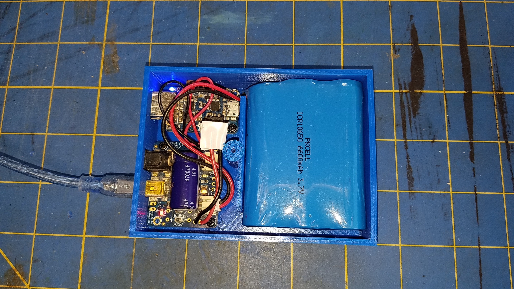
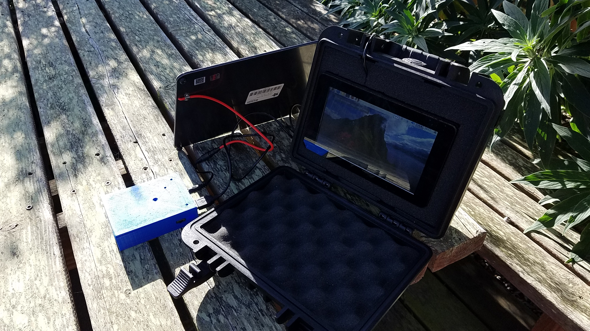
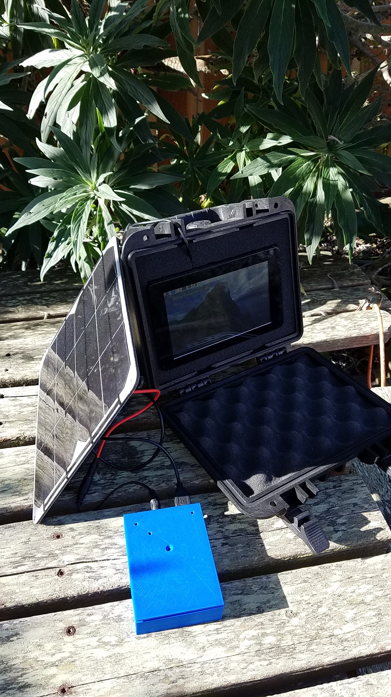
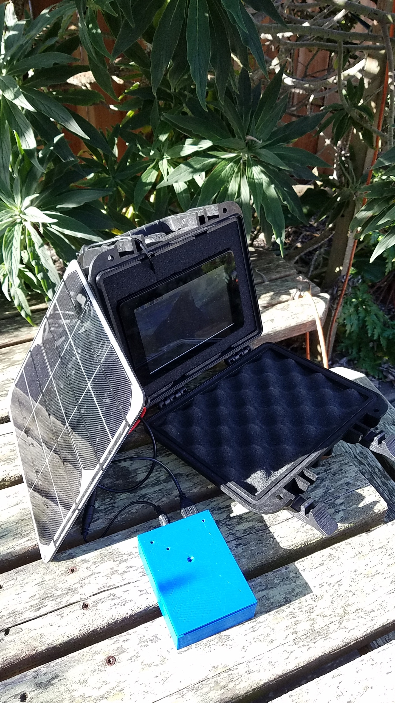

## Enclosures, for batteries and boosters.
Designed to contain
- MCP73871_USB_Solar (https://www.adafruit.com/product/390)
- PowerBooster 1000C (https://www.adafruit.com/product/2465)
- Lithium Ion Cylindrical Batteries, of various sizes ([1](https://www.adafruit.com/product/1781), [2](https://www.adafruit.com/product/354), or [3](https://www.adafruit.com/product/353) cells)

---

| A 6600 mAh box | Feeding a Raspberry Pi |
|:--------------:|:--------------:|
|  |  |
| Feeding a Raspberry Pi | Feeding a Raspberry Pi |
|  |  |

---
