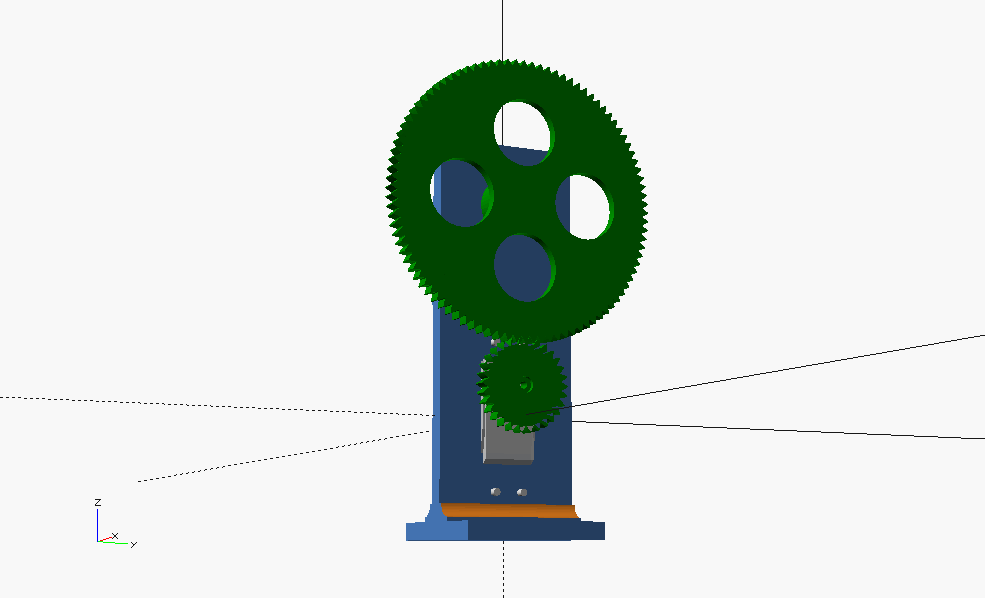
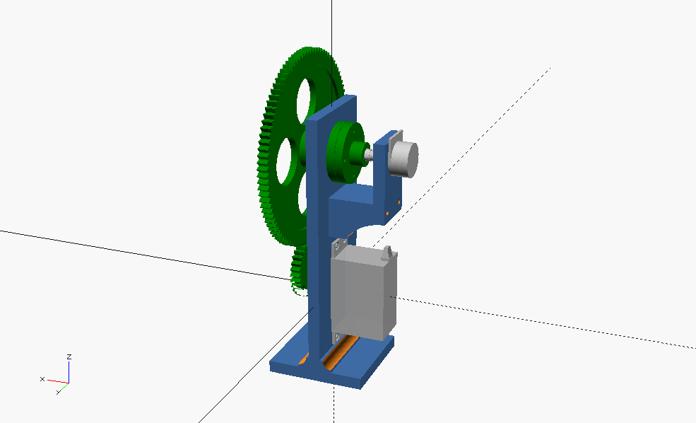

# Feedback Potentiometer POC

## Setting

We have
- A continuous servo, rotating a small wheel.
- The small wheel rotates a big wheel.
- There is a B10K linear potentiometer attached to the big wheel, to measure its rotation state.

 |  |  |
 |:----------------------:|:----------------------:|

---
