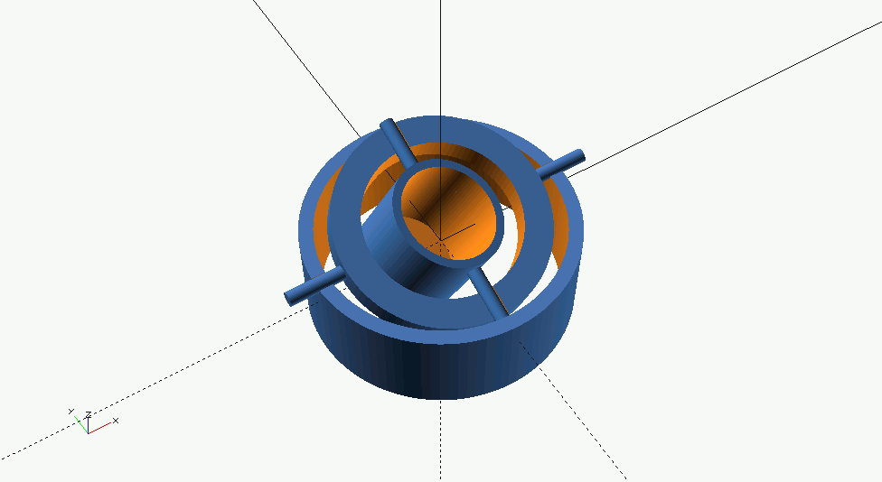

## A gimbal

This is a gimbal for a small PCB magnetometer like an [HMC5883L](https://learn.adafruit.com/adafruit-hmc5883l-breakout-triple-axis-magnetometer-compass-sensor?view=all#breakout-board-design-5-4).

As before, the `stl` are generated from the `SCAD` script `gimbal.scad`, they are available in the `stl` folder.

