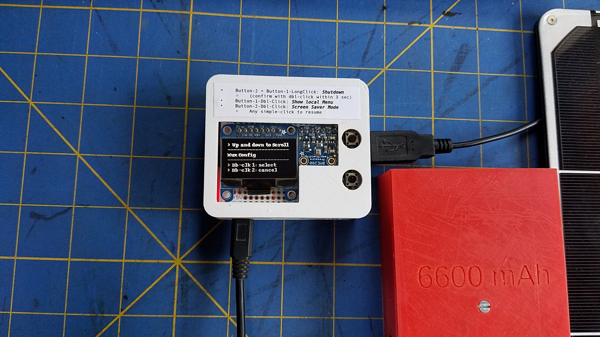

# An enclosure for a Raspberry Pi A+ server/logger
The Software details are provided [here](https://github.com/OlivierLD/raspberry-coffee/tree/master/NMEA-mux-WebUI/full-server-extended-v2).

| Full Setting                      | Closer look                      | Menu                        |
|:----------------------------------|:---------------------------------|:----------------------------|
|  |  |  |

On the first image, the USB connector (right of the white box) is the GPS.

`STL` files for the logger enclosure are provided here. The Solar Charger/Booster is part of another module in this project.

- The white box is 3D-printed.
- The label is 2D-printed (`odt` and `pdf` provided).

---
