# Navigation Stations

## Small one, with optional e-ink Bonnet
GPS and Power supply externalized.  
[Code](../ProjectBoxRPiZeroBox.scad), 
[Details](https://github.com/OlivierLD/ROB/blob/master/raspberry-sailor/MUX-implementations/NMEA-multiplexer-basic/HOWTO.md)

| Empty                       | With a Raspberry Pi            | With Top                 |
|:---------------------------:|:------------------------------:|:------------------:|
| 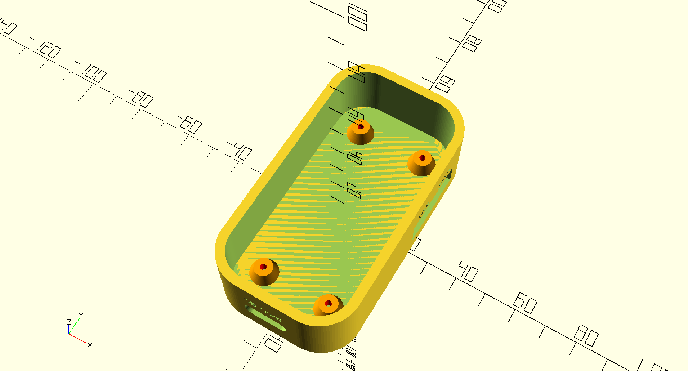 | 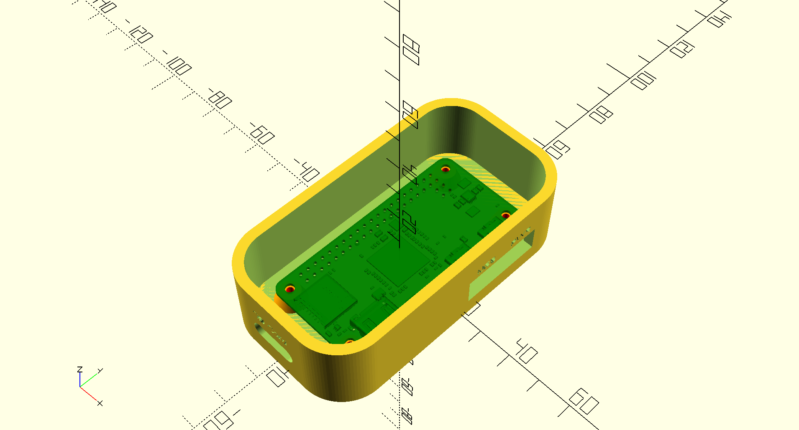 | 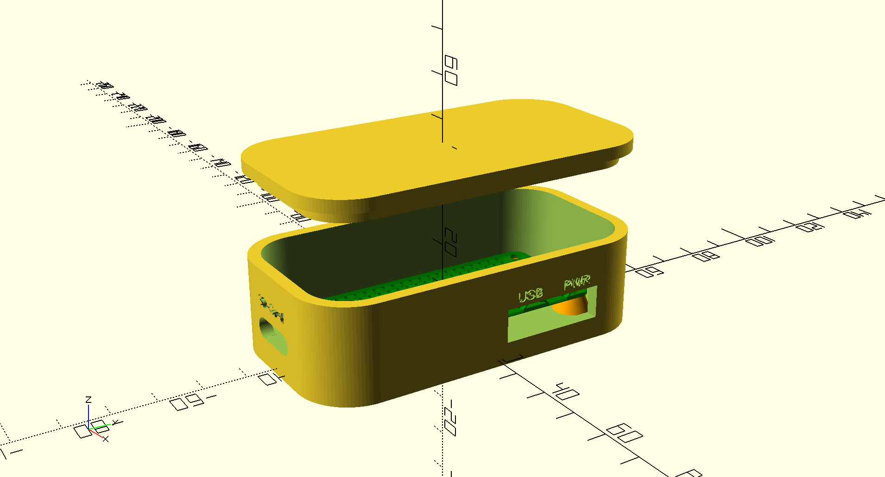 |

## Autonomous, self contained, with optional e-ink Bonnet
GPS, Power Bank, e-ink bonnet.  The software part is the same as above.  

[3D part Code](./raspberry.pi.zero.custom.plate.scad)

| | |
|:-----------------------------------------------:|:-----------------------------------------------:|
| 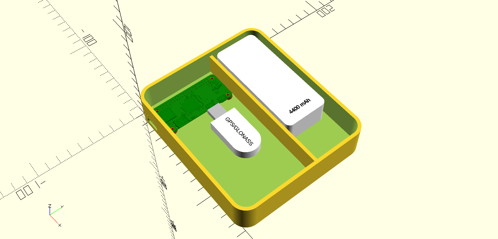 | 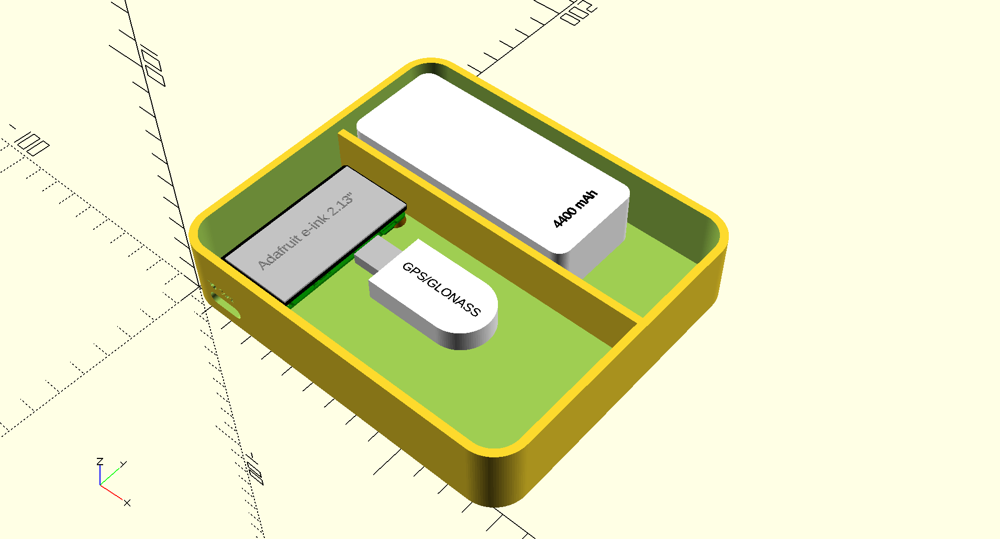 | 
| No e-ink screen | With e-ink screen |
| 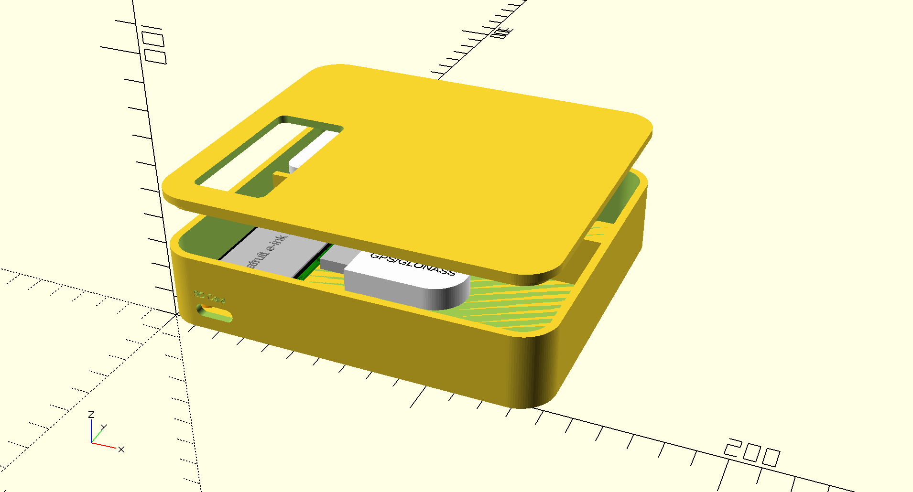 | 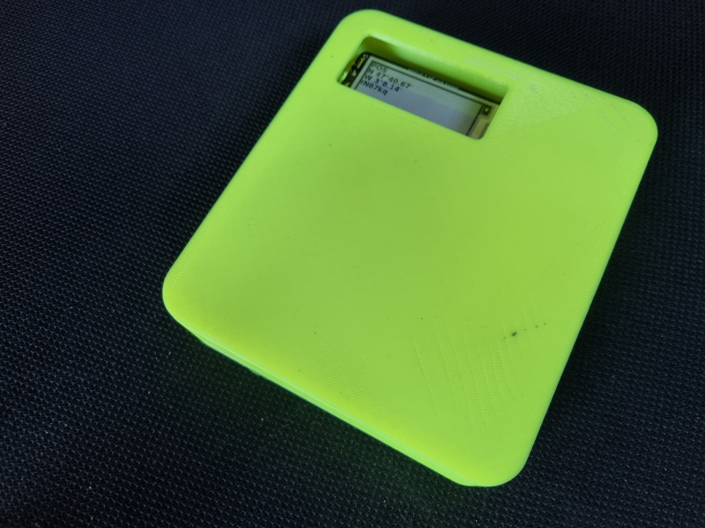 |
| with top | Printed, for real |

### With a BME280 
#### For Atmospheric Pressure, Relative Humidity, Air Temperature
A Barograph is a very useful instrument for marine weather and forecasts. But it can be quite expensive (see [here](https://www.naudet.com/barometre-enregistreur-c102x2726134)). We'll trry to build one with a Raspberry Pi Zero, and a sensor like a BME280 sensor (less that $2.00).  
A BME280 sensor can be obtained from many providers. See [here](https://www.bosch-sensortec.com/products/environmental-sensors/humidity-sensors-bme280/) for the specs.

<table style="width: 100%; margin: auto;">
<tr><td style="width: 50%;">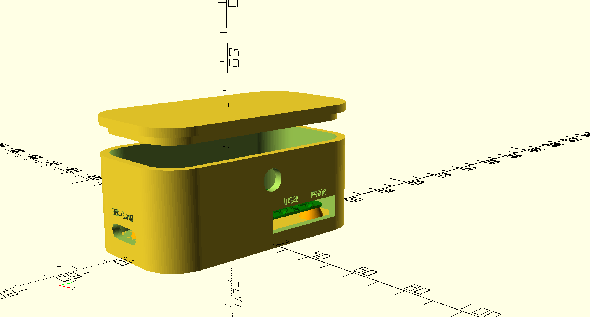</td><td style="width: 50%;">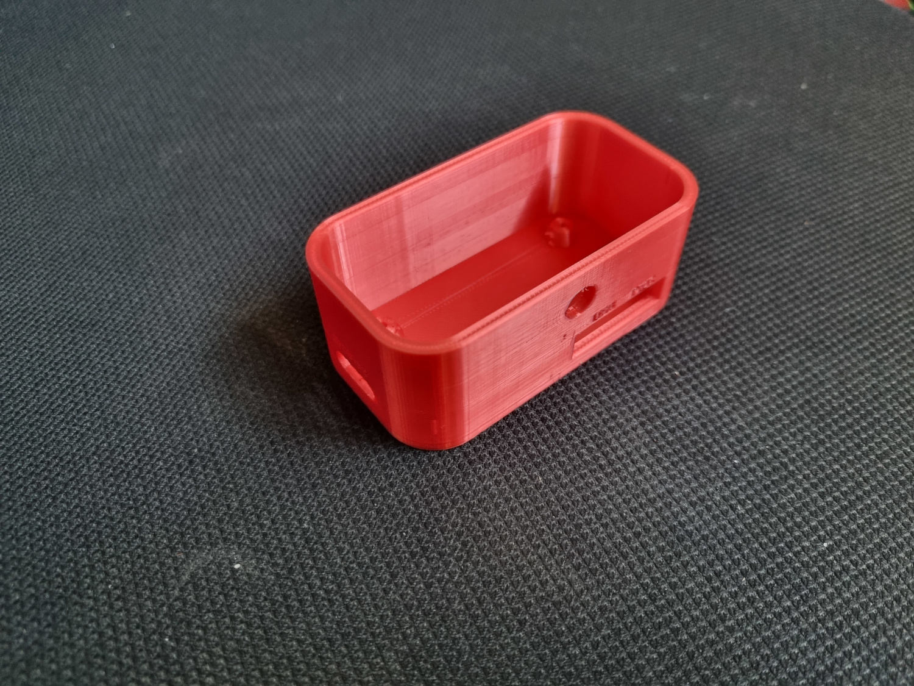</td></tr>
<tr><td>A taller box, for I2C connection on the header</td><td>Printed</td></tr>
<tr><td>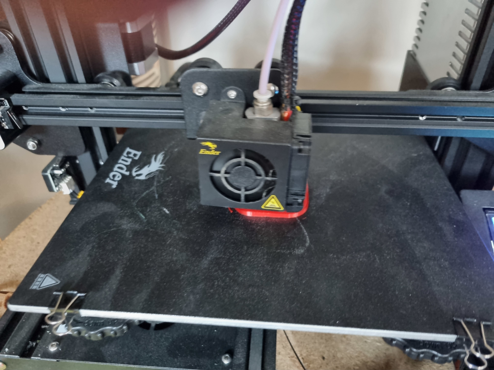</td><td>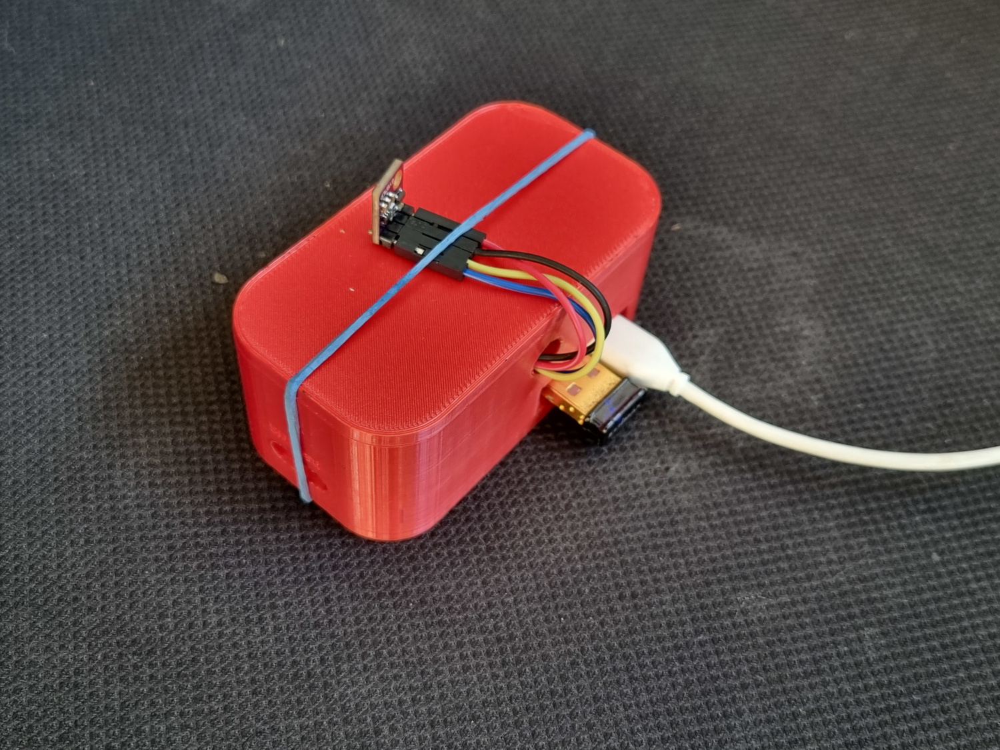</td></tr>
<tr><td>Printing the lid</td><td>First test</td></tr>
<tr><td colspan="2">External 3D printed enclosure for the sensor, see <a href="https://www.thingiverse.com/thing:1067700" target="ThingVerse">here</a></td></tr>
<tr><td>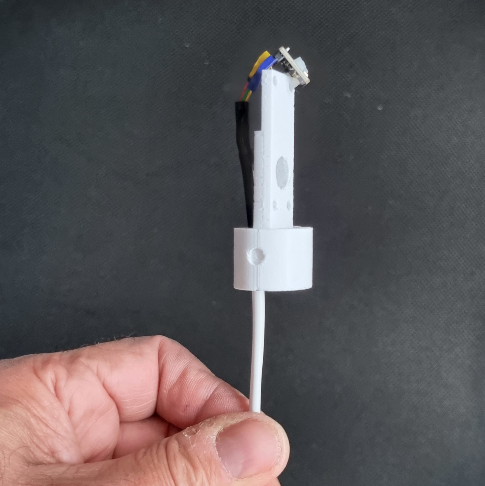</td><td>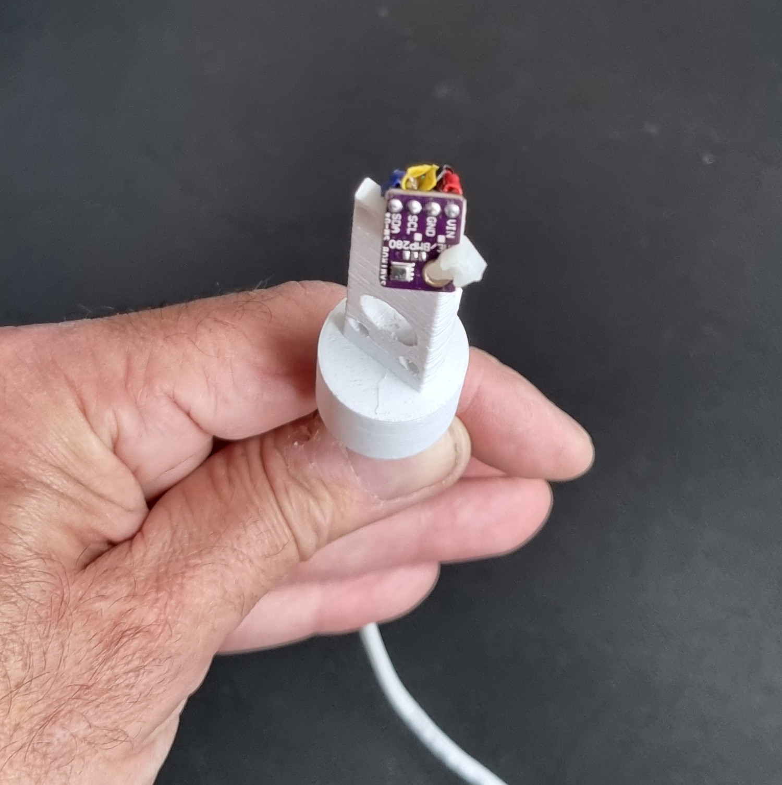</td></tr>
<tr><td>BME280 connected, ready to go, one</td><td>BME280 connected, ready to go, two</td></tr>
<tr><td>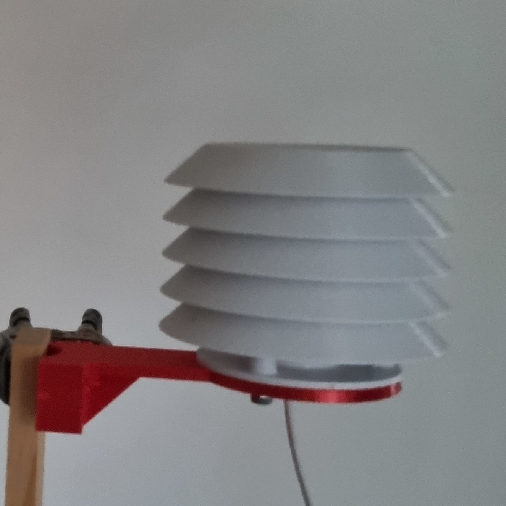</td><td>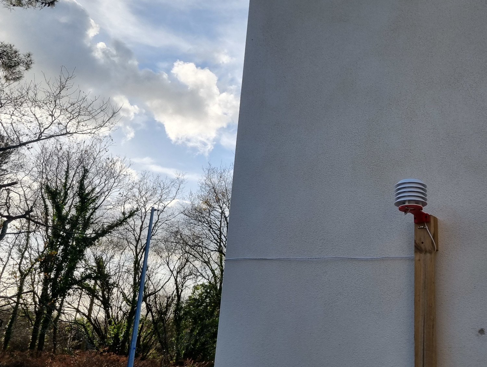</td></tr>
<tr><td>Outside part</td><td>In place</td></tr>
</table>

For details on the software, see [here](https://github.com/OlivierLD/ROB/blob/master/raspberry-sailor/MUX-implementations/NMEA-multiplexer-basic/use_cases/USE_CASES_4.md).  

Data can be rendered in a Web UI:  
  
Top part show real-time data, graphs at the bottom can spread across one week (one data point every 15 minutes).

## RasPi A+
BME280 and Oled Screen  
[Code](../../RPiA+Logger/rpi.aplus.enclosure.scad), [Details](https://github.com/OlivierLD/ROB/blob/master/raspberry-sailor/MUX-implementations/NMEA-multiplexer-basic/use_cases/USE_CASES_2.md)

## TODO
- With a compass (magnetometer)
- Document the Barograph / Thermograph, with a BMP180, BME180 or BME280