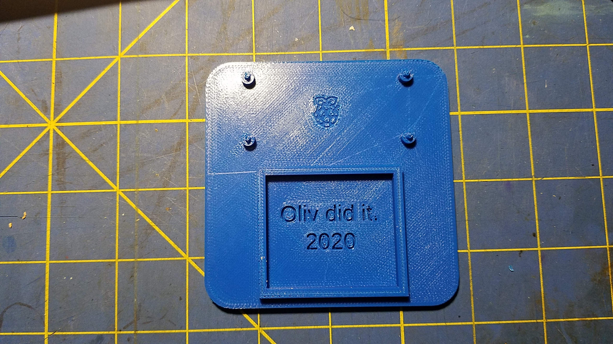
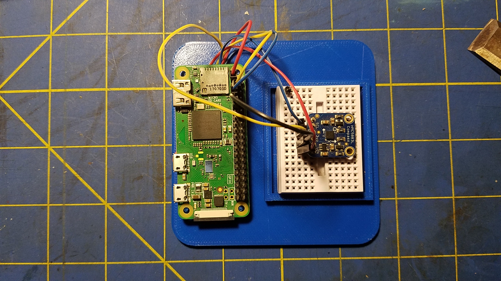
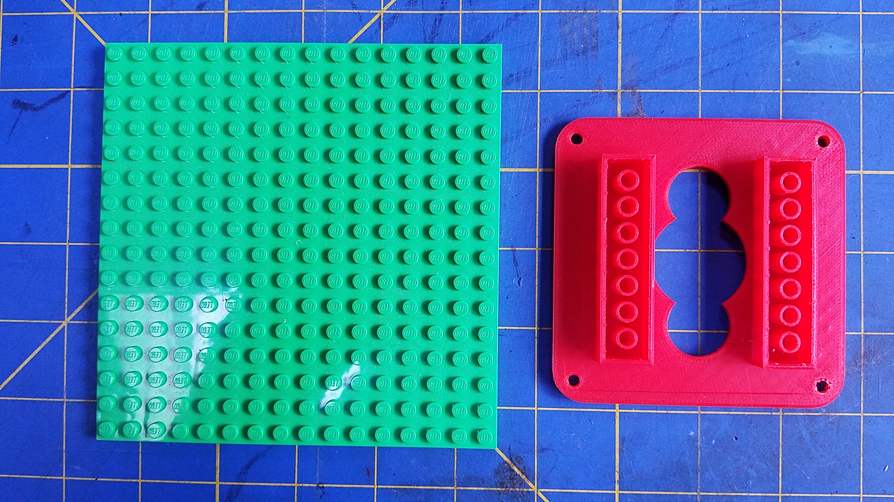
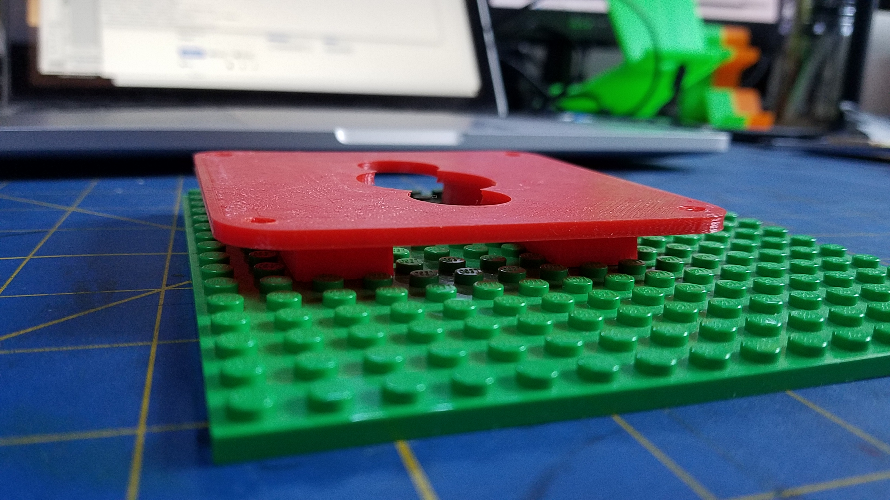
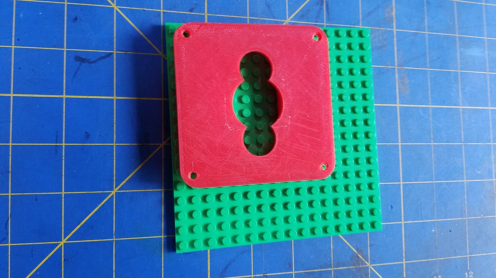
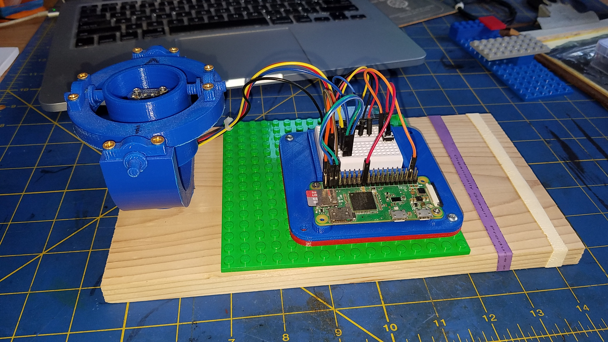

# Small Development Setup for a Raspberry Pi Zero
- Holds a Raspberry Pi Zero (any model)
- There is a small breadboard (45.6mm x 35mm) beside.

| Printed                          | Ready                        |
|:--------------------------------:|:----------------------------:|
|  |  |

# Small Development Setup for a Raspberry Pi B

## WiP
All is is constantly evolving.

There is also a version with Lego &reg; feet.
Check out the `stl` files.

|  |  |
|:---------------------------:|:---------------------------:|
|  |  |

---
