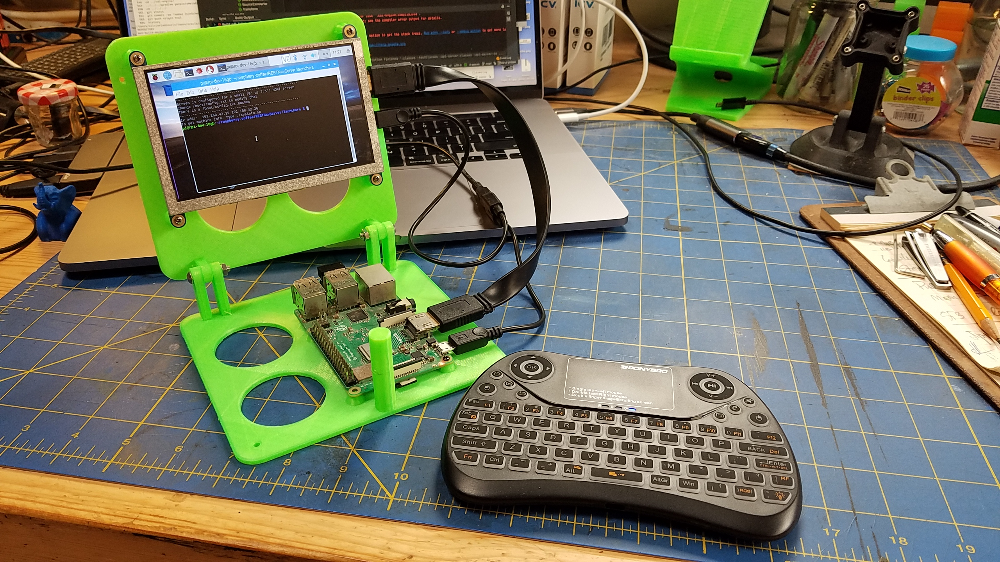
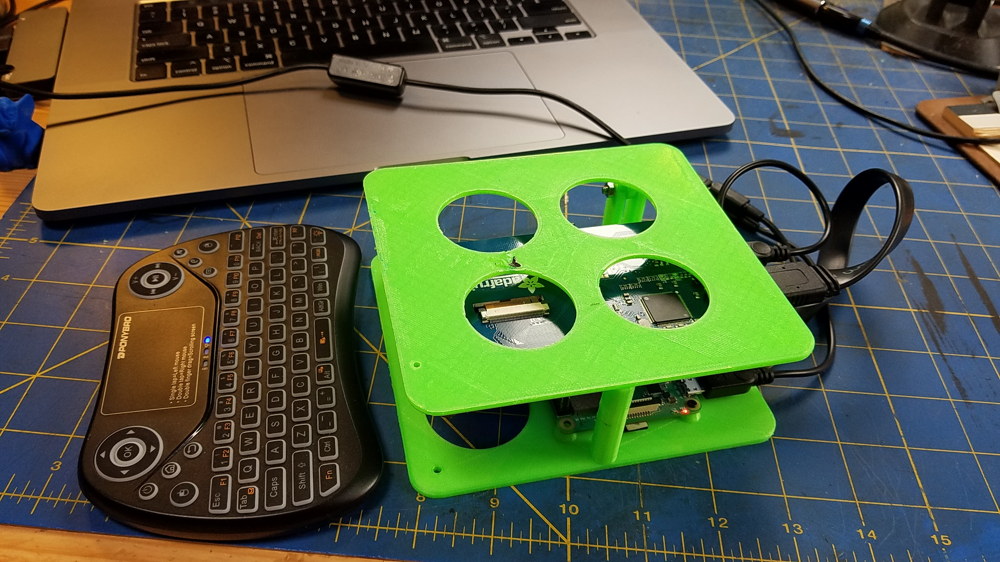

An enclosure for:
- A Raspberry Pi B*
- A 5" HDMI Screen

- TODO Camera Stand

- Compatible with addons:
	- Camera
	- Loud speakers
	- USB Pports (accessible), wireless keyboards
	- Battery power supply (from anther project)
	- etc
