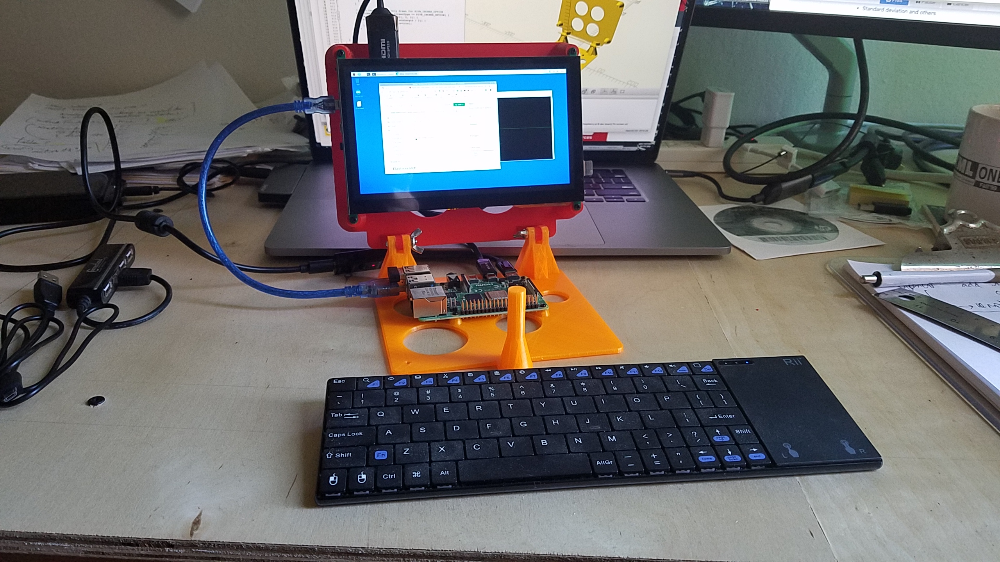

# Raspberry Pi based fully featured small laptop
Motivation:
- I want a laptop
- I need to bring it with me, _anywhere_
- Possibly with a Desktop GUI
- A camera (webcam)
- Loud-speakers
- I want to do some coding (Java, Python, Arduino, etc...)
- I want to access the Internet
- I want to play music
- I want to play movies
- ... I want everything.

---

You will need:
- A Raspberry Pi B* or A* (to play movies, RPi 4 Model B is recommended)
- A [5" HDMI Screen](https://www.adafruit.com/product/2232)
- [USB Power splitter cable](https://www.adafruit.com/product/3030)
- [HDMI-to-HDMI cable](https://www.adafruit.com/product/2197), or [this one](https://www.adafruit.com/product/2420)

### Basic setting
Open:


Closed:


- Several wireless (BlueTooth) keyboards, from small to big
	1. <https://www.adafruit.com/product/922>
	1. <https://www.amazon.com/Backlit-Wireless-Handheld-Keyboard-Raspberry/dp/B06X9J8NG4/ref=pd_lpo_147_img_1/132-2131550-8967002?_encoding=UTF8&pd_rd_i=B06X9J8NG4&pd_rd_r=868a987d-dbc9-4360-be6c-5f3659fa807d&pd_rd_w=UI73u&pd_rd_wg=HXJQf&pf_rd_p=7b36d496-f366-4631-94d3-61b87b52511b&pf_rd_r=2SB0MAK1CH5G4W9S4ATT&psc=1&refRID=2SB0MAK1CH5G4W9S4ATT>
	1. <https://www.adafruit.com/product/2876>
	1. <https://www.adafruit.com/product/1738>

---

- Compatible with addons like:
	- Camera
	- Loud speakers
	- USB Ports (accessible), wireless keyboards, BlueTooth dongles, USB Drives, etc
	- Battery power supply (from [another project](https://github.com/OlivierLD/3DPrinting/tree/master/OpenSCAD/Battery.Cases), solar etc)
	- etc

Sound and video on the Raspberry Pi:
- <https://www.raspberrypi.org/documentation/configuration/audio-config.md>
- <https://www.raspberrypi.org/documentation/usage/camera/raspicam/README.md>

VLC:
```
$ sudo apt-get update
$ sudo apt-get install vlc
```

Camera Stand:
- <https://www.adafruit.com/product/1434>
- <https://www.amazon.com/gp/product/B000CNPK3M/ref=oh_aui_search_detailpage?ie=UTF8&psc=1>

Loud Speakers
- <https://www.adafruit.com/product/1363>

| With Camera and loud speakers | Playing movie           |
|:-----------------------------:|:-----------------------:|
|         |   |
| Playing movie                 | Webcam, taking snapshot |
|         |   |

Screen Saver:
```
$ sudo apt install xscreensaver
```

Turn screen off:
```
$ export DISPLAY=:0.0
$ xset dpms force off
```
Comes back on a click.

Autonomous setting:


With a [UCTronics 7" screen](https://www.uctronics.com/display/uctronics-7-inch-touch-screen-for-raspberry-pi-1024-600-capacitive-hdmi-lcd-touchscreen-monitor-portable-display-for-pi-4-b-3-b-windows-10-8-7-free-driver.html), high definition, and a wireless bluetooth keyboard.


STL files featured [here](./stl/raspberry.pi.B.dev.board.7in.screen.stl).
