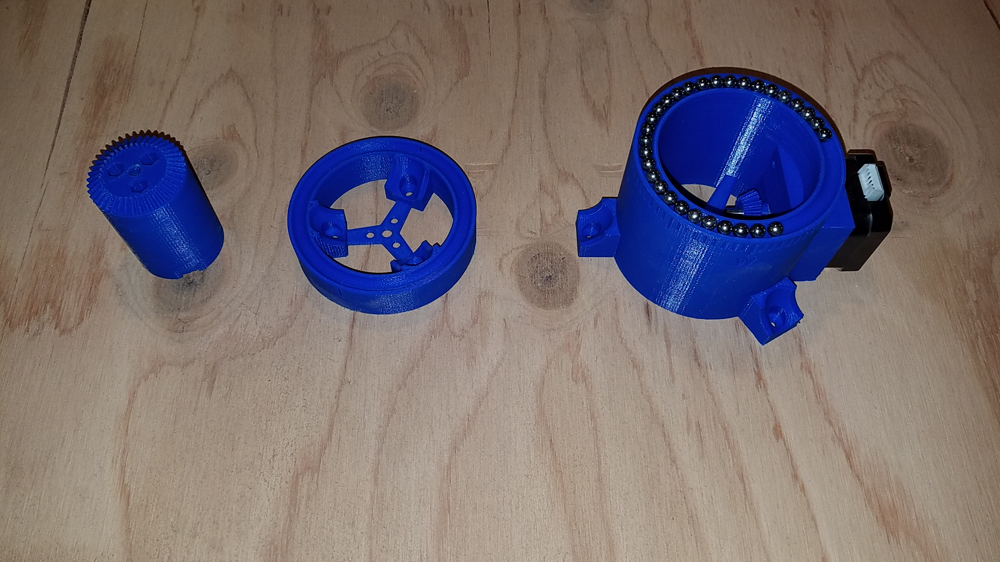
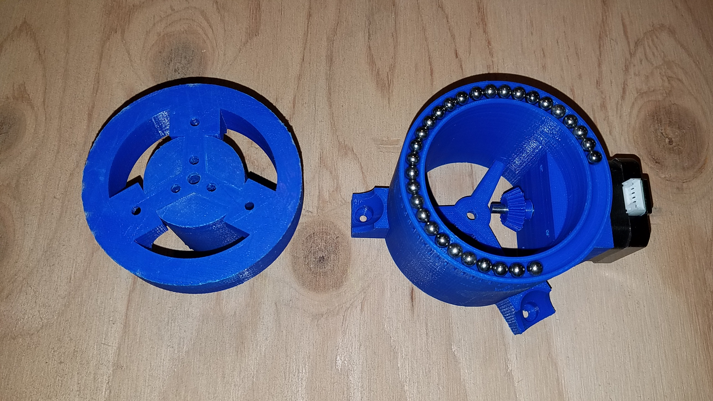
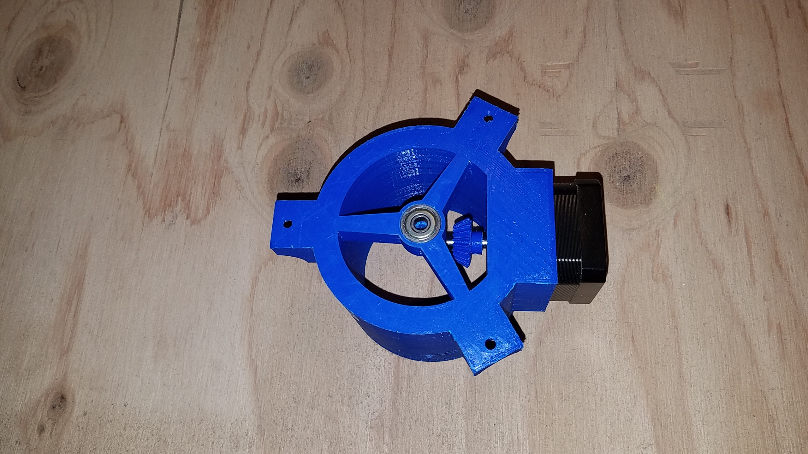

### SunFlower, V3 
This is a work in progress...

This will look a lot like the SunFlower V2, but all the gears will be 3D printed too, no need to buy them, only the stepper motors are required, no extra axis, no worm gear.

For now, look in the `stl` folder to visualize the part designs.

## Script Hierarchy

### Data
- Bevel Gear:
	- Gear: 40 teeth
	- Pinion: 20 teeth

### Pictures

New parts:
- Bevel gear with its base
- Smaller top base, will hold the base of the bevel gear
- Bottom base, with a socket for the motor holding the pinion

- Bevel gear and top base together

- Bottom ball bearing
