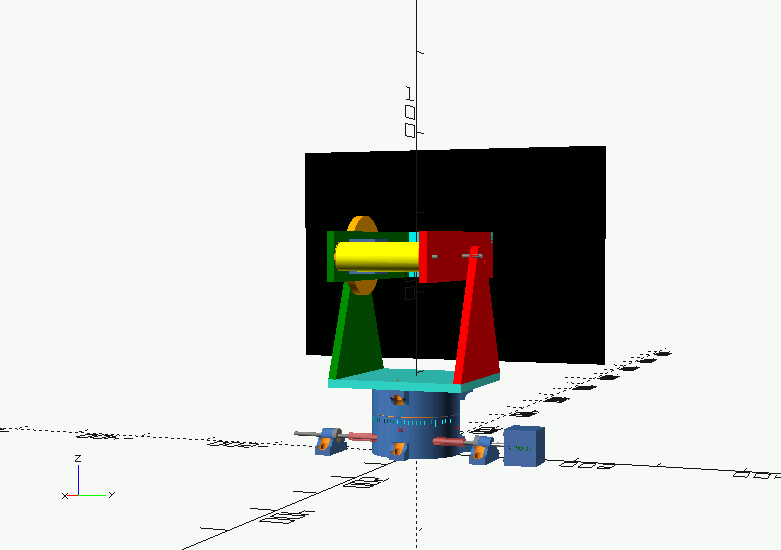

## Orientable Solar Panel Stand

- This is the _hardware_ part of the [SunFlower v2 project](https://github.com/OlivierLD/raspberry-coffee/tree/master/Project.Trunk/SunFlower.v2). The goal is to orient _**automatically**_ a solar panel so it faces the sun, in order to optimize its performance.
- The idea is to extend the project featured [here](https://github.com/OlivierLD/raspberry-coffee/tree/master/Project.Trunk/SunFlower). In the original project, the panel is moved by some small micro-servos. This was used mostly to validate the software part, the one used to get to the sun's position in the sky.
- This project contains what's needed to build all the required _hardware_ parts. The `stl` files (to send to the 3D printer) are generated from the provided `OpenSCAD` scripts, as explained below.

#### A first preview



> Note: `github` supports the rendering of `stl` files. Click them above (in the `stl` folder) to **see** them.

- Here we want to use stepper motors, more powerful. If that works, extending the idea to manipulate bigger panels should not be a problem. Gears and other worm gears provide the possibility to change the power ratio, depending on the weight of the panels to move.

- I started from the hardware of [this instructable](https://www.instructables.com/id/Ammo-Can-Solar-Power-Supply/), and now want to have the solar panel powering the battery facing the sun as long as the sun is in the sky. This is what the device presented here is all about.
> I used the hardware above (solar panel + battery) to power a Raspberry Pi. The idea is to use the
> Raspberry Pi to optimize the orientation of the panel. Win-win 😎.

### How-to
Different parameter sets can drive the printing process as well as the preview process. The same parameter sets (scripts) drive the two processes. Those parameter sets are held in files named like `param.set.**.scad`.

- To **_print_** the different parts, in `OpenSCAD`, use the script named `printing.scad`, which refers to scripts like `param.set.**.scad`, containing distinct sets of parameters.
	- Set the `option` variable in the `printing.scad` script so it matches the part to print.
	- Preview your part.
	- Generate the `stl` file.
- To **_visualize_** the current state of the art, open `the.full.stand.scad` in `OpenSCAD`. This script itself is driven by the same parameter files as above, mentioned in the `include` statement, like `include <./param.set.0*.scad>`. Change the `include` statement in `the.full.stand.scad` to refer to the required set of parameters.

#### Preview
To view the full device, with the set of parameters contained in `param.set.03.scad`, modify the `include` statement in the `the.full.stand.scad` so it looks like this:
```
include <./param.set.03.scad>
```
and then run the script (or use `F5` or `F6`).

This is what the animation above has been generated with.

#### Prepare for printing
To prepare the bottom base (for example) for printing with the parameters of `param.set.04.scad`:
- Load `printing.scad` in `OpenSCAD`
- Make sure the `include` statement refers to `param.set.04.scad`, or your specific set of parameters:
```
include <./param.set.04.scad>
```
- In the code editor, set the `option` variable you need, to `PRINT_BASE_1` if this is the bottom base you want:
```
. . .

PRINT_BRACKET = 1;
PRINT_BASE_1 = 2;
PRINT_BASE_2 = 3;
PRINT_MAIN_STAND = 4;
PRINT_COUNTERWEIGHT_CYLINDER = 5;
PRINT_BIG_WHEEL_STAND = 6;
PRINT_BALL_BEARING_STAND = 7;
. . .

// Choose your own here
option = PRINT_BASE_1;

. . .
```
- Then render the part (use `F6`) (_note: The screenshot below might not be 100% in sync..., the code is constantly evolving_)

- Finally Export as STL (use `F7`)
- Your generated STL file is ready to be used on your 3D printer.

#### Building
The following indications may vary, according to your own options.

After preparing the parts as explained above, you need to 3D-print:
- 1 &times; [Bottom base](stl/base.one.stl)
- 1 &times; [Top base](stl/base.two.stl)
- 1 &times; [Main Stand](stl/main.stand.stl)
- 1 &times; [Big Wheel Stand](stl/big.wheel.stand.stl)
- 1 &times; [Counterweight Cylinder](stl/counter.weight.stl)
- 1 &times; [Bracket](stl/bracket.stl)
- 2 &times; [Ball Bearing Stands](stl/ball.bearing.stand.stl)
- Optionally, 1 [plate](stl/panel.plate.stl) for the solar panel to fit on top of the bracket.

_Alternatively, if your 3D printer is not big enough for the parts above_:
- You may print the big ones in several parts, screwed together with M4 bolts
  - The main stand, in 3 parts:
    - [Bottom](stl/main.stand.base.stl)
    - [Left](stl/main.stand.left.stl)
    - [Right](stl/main.stand.right.stl)
  - The bracket, in 3 parts:
    - [Top](stl/bracket.top.stl)    
    - [Left](stl/bracket.left.stl)    
    - [Right](stl/bracket.right.stl)    

##### _**BOM**_ (in progress, details to come)
Hardware mechanical parts (may vary, depending on your options)
- [Bearing balls](https://www.amazon.com/Piece-Assorted-Loose-Bicycle-Bearing/dp/B018B7D05K/ref=pd_rhf_se_p_img_9?_encoding=UTF8&psc=1&refRID=96QW6AH9VWVPRN8HJ1FY) (diam 1/4" in my case, 38 pieces)
- Ball Bearings [5mm](https://www.amazon.com/gp/product/B07DZDZNJM/ref=ppx_yo_dt_b_asin_title_o00_s03?ie=UTF8&psc=1) and [6mm](https://www.amazon.com/gp/product/B07DZKDKSF/ref=ppx_yo_dt_b_asin_title_o00_s03?ie=UTF8&psc=1).
- [Threaded rods](https://www.amazon.com/gp/product/B078HC51KK/ref=ppx_yo_dt_b_asin_title_o00_s02?ie=UTF8&psc=1), several diameters (4, 5, and 6mm).
- [Rods](https://www.amazon.com/gp/product/B07KJ8DGF3/ref=ppx_yo_dt_b_asin_title_o00_s01?ie=UTF8&psc=1), 5mm.
- Nuts, bolts, washers...
- [Pinion](https://www.amazon.com/gp/product/B07RVJCQS5/ref=ppx_yo_dt_b_asin_title_o00_s03?ie=UTF8&psc=1) and [wheel](https://www.amazon.com/gp/product/B00KVN5BKU/ref=ppx_yo_dt_b_asin_image_o01_s00?ie=UTF8&psc=1)
- [Worm gear set](https://www.amazon.com/gp/product/B07G54YQL4/ref=ppx_yo_dt_b_asin_title_o00_s02?ie=UTF8&psc=1)
- [Couplers](https://www.amazon.com/gp/product/B07M5Q7HTV/ref=ppx_yo_dt_b_asin_image_o00_s05?ie=UTF8&psc=1)
- [Motor stand](https://www.amazon.com/gp/product/B06XPX7PPB/ref=ppx_od_dt_b_asin_title_s03?ie=UTF8&psc=1).

And then
- 2 &times; [Stepper motors](https://www.adafruit.com/product/324) (NEMA-17 in my case, may vary)
- Raspberry Pi with its SD Card, power supply, etc.
- [Adafruit Motor Hat](https://www.adafruit.com/product/2348)
- The required software is (or will be) [here](https://github.com/OlivierLD/raspberry-coffee/tree/master/Project.Trunk/SunFlower.v2).

In this configuration:
- The pinion has 18 teeth
- The big wheel has 128 teeth.

=> The ratio is 18:128, which is 1:7.1111111.

- The chosen worm gear set has a ratio of 1:40.

As the `NEMA-17` stepper motor has 200 possible positions:
- **On the horizontal axis (big wheel)**: That makes 1,422 possible angles, resulting in a resolution of `15.19` minutes of arc.
- **On the vertical axis**: We have 8,000 possible angles, resulting in a resolution of `2.7` minutes of arc.

Those resolutions should be good enough!

### Story-board
. . . To come, pictures of the whole process.

---
