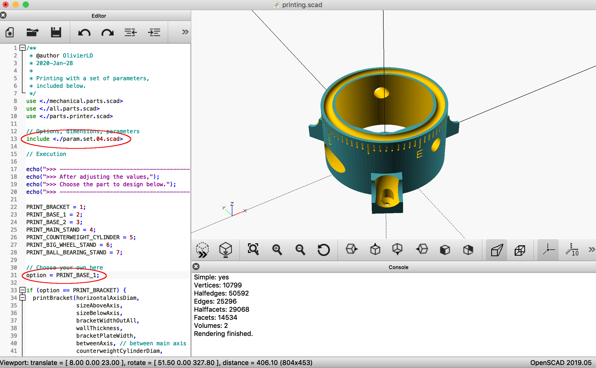

## README

- The idea is to extend the project featured [here](https://github.com/OlivierLD/raspberry-coffee/tree/master/Project.Trunk/SunFlower). In the original project, the panel is moved by some small micro-servos. This was used mostly to validate the software part, the one used to get to the sun's position.

- Here we want to use stepper motors, more powerful. If that works, extending the idea to manipulate bigger panels should not be a problem. Gears and other worm gears provide the possibility to change the power ratio, depending on the weight of the panels to move.

- I started from the hardware of [this instructable](https://www.instructables.com/id/Ammo-Can-Solar-Power-Supply/), and now want to have the solar panel powering the battery facing the sun as long as the sun is in the sky. This is what the device presented here is all about.

### How-to
Different parameter sets can drive the printing process as well as the preview process. The same parameter sets (scripts) drive the two processes. Those parameter sets are held in files named like `param.set.**.scad`.

- To **_print_** the different parts, in `OpenSCAD`, use the script named `printing.scad`, which refers to scripts like `param.set.**.scad`, which hold distinct sets of parameters.
	- Set the `option` variable in the `printing.scad` script so it matches the part to print.
	- Preview your part.
	- Generate the `stl` file.
- To **_visualize_** the current state of the art, open `the.full.stand.scad` in `OpenSCAD`. This script itself is driven by the same parameter files as above, mentioned in the `include` statement, like `include <./param.set.0*.scad>`. Change the `include` statement in `the.full.stand.scad` to refer to the required set of parameters.

#### Examples
##### Preview
To view the full device, with the set of parameters contained in `param.set.03.scad`, modify the `include` statement in the `the.full.stand.scad` so it looks like this:
```
include <./param.set.03.scad>
```
and then run the script (or use `F5` or `F6`).

##### Prepare for printing
To prepare the bottom base (for example) for printing with the parameters of `param.set.03.scad`:
- Load `printing.scad` in `OpenSCAD`
- Make sure the `include` statement refers to `param.set.03.scad`
```
include <./param.set.03.scad>
```
- In the code editor, set the `option` variable you need, to `PRINT_BASE_1` if this is the bottom base you want:
```
. . . 

PRINT_BRACKET = 1;
PRINT_BASE_1 = 2;
PRINT_BASE_2 = 3;
PRINT_MAIN_STAND = 4;
PRINT_COUNTERWEIGHT_CYLINDER = 5;
PRINT_BIG_WHEEL_STAND = 6;
PRINT_BALL_BEARING_STAND = 7;

// Choose your own here
option = PRINT_BASE_1;

. . .
```
- Then render the part (use `F6`)

- Finally Export as STL (use `F7`)
- Your generated STL file is ready to be used on your 3D printer.

#### First preview


> Note: `github` supports the rendering of `stl` files. Click them above to **see** them.

#### Building
After preparing the parts as explained above, you need to 3D-print:
- 1 x [Bottom base](base.one.stl)
- 1 x [Top base](base.two.stl)
- 1 x [Main Stand](main.stand.stl)
- 1 x [Big Wheel Stand](big.wheel.stand.stl)
- 1 x [Counterweight Cylinder](counter.weight.stl)
- 1 x [Bracket](bracket.stl)
- 2 x [Ball Bearing Stands](ball.bearing.stand.stl)

_**BOM**_ (in progress)
- ...

---
