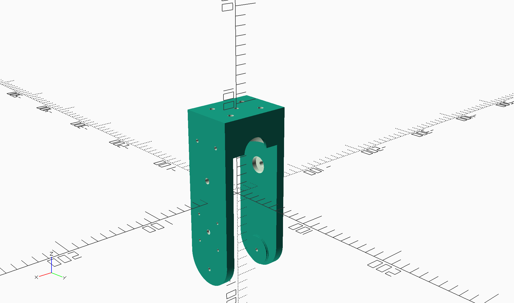

# SunFlower
## Orienting a solar panel, so it faces the Sun

The code for the software part is at <https://github.com/OlivierLD/raspberry-coffee/tree/master/Project-Trunk/SunFlower-v2>.

Several versions are pesented here.  
They all have
- A base
- A stand
- A bracket

The bracket goes in the stand, the stand goes on top of the base.

| Base | Stand | Bracket |
|:------------------------------------------------------:|:----------------------------------------------------:|:------------------------------------------------:|
|  |  |   |

In the versions presented in the folder, only the base is changing. Brackets and Stands are the same.

---
