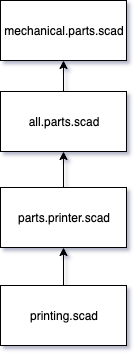
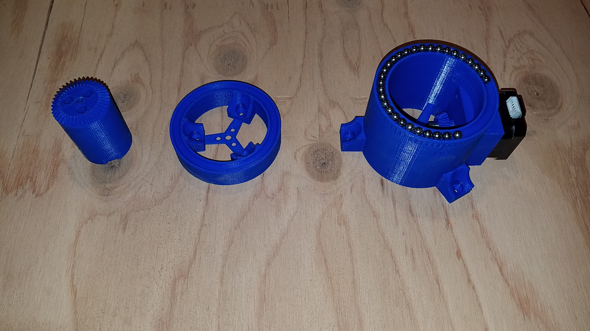
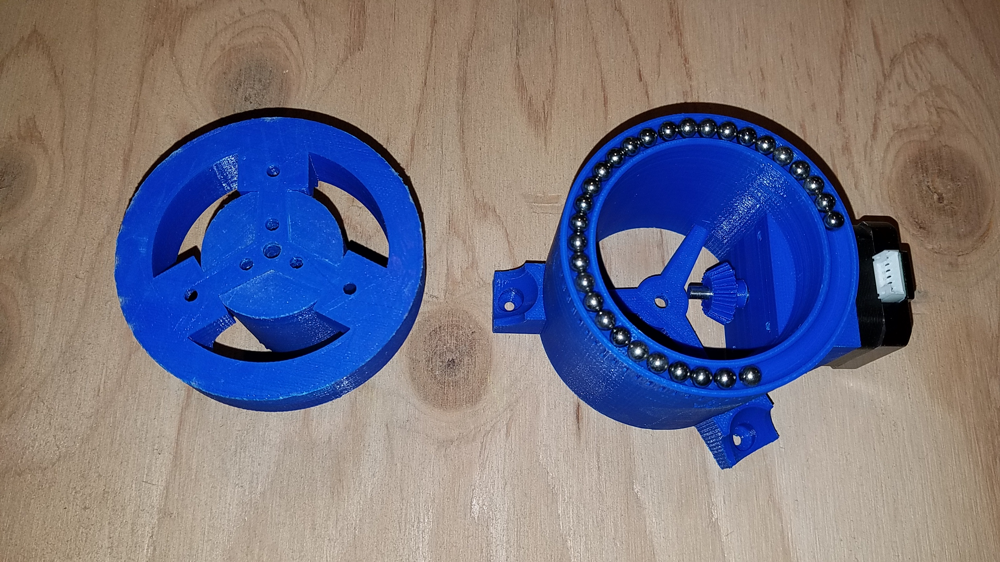
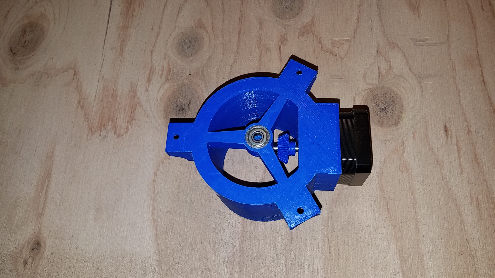

### SunFlower, V3 
This is a work in progress...

To discover - or learn - what this does, start with `printing.scad`.

This will look a lot like the SunFlower V2, but all the gears will be 3D printed too, no need to buy them, only the stepper motors are required, no extra axis, no worm gear.

For now, look in the `stl` folder to visualize the part designs.

## Script Hierarchy

### Data
- Bevel Gear:
	- Gear: 40 teeth
	- Pinion: 20 teeth

### Pictures

New parts:
- Bevel gear with its base
- Smaller top base, will hold the base of the bevel gear
- Bottom base, with a socket for the motor holding the pinion

- Bevel gear and top base together

- Bottom ball bearing

### Lessons learned
The 3D printed gears (specially the pinion, on the motor axis) are difficult to lock in place. The PLA seems not to be strong enough to hold the screws and bolts...
Metallic gears would not have this problem.

Something to keep in mind for V4.
