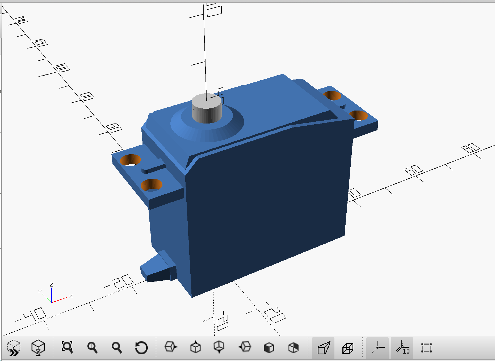
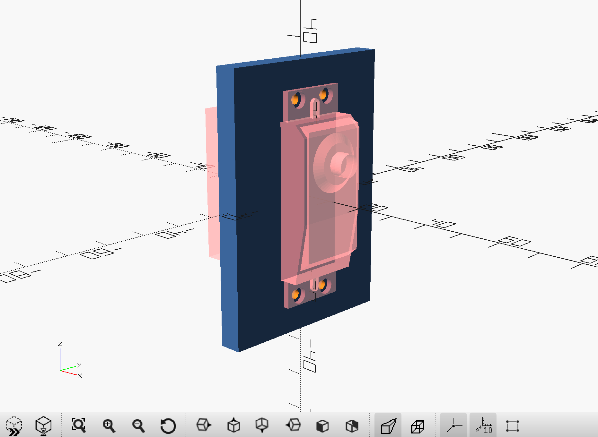
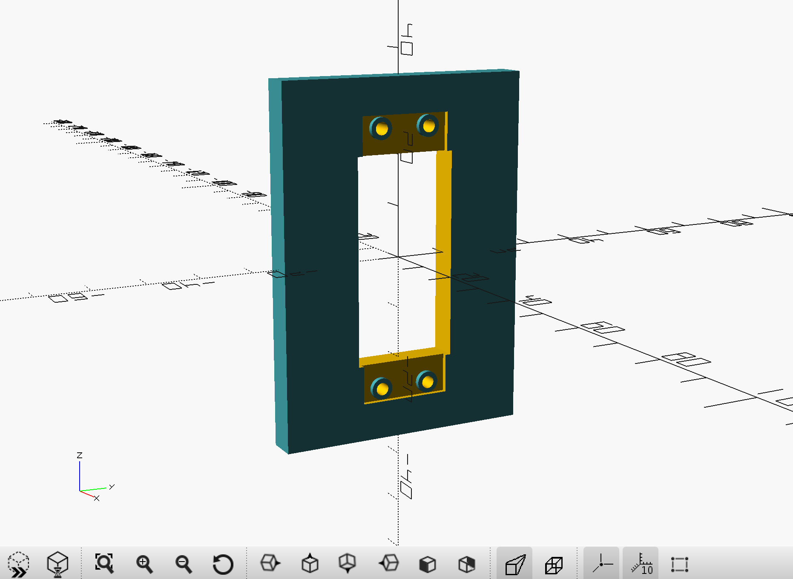

## Misc reusable stuff

Include (with a `use <...>`) this script, and reuse the parts it contains

Example
```
use <../mechanical.parts.scad>
```

Those parts can be used also to set the space they occupy, with a `difference()`.
For example, you can display a servo, or the socket that will hold it.

|  Servo                         | Servo Socket, debug mode             | Servo Socket, good to print          |
|:------------------------------:|:------------------------------------:|:------------------------------------:|
|  |  |  |

### Content

- ballBearing
- metalScrewCS
- metalScrewHB
- hexNut
- washer
- B10K (Linear potentiometer)
- servoParallax900_00005
- MCP73871_USB_Solar
- AdafruitPowerboost1000C
- PkCell
